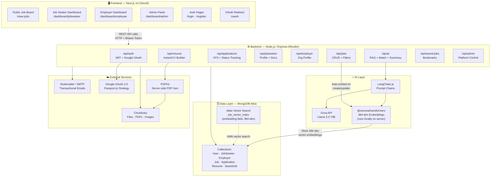
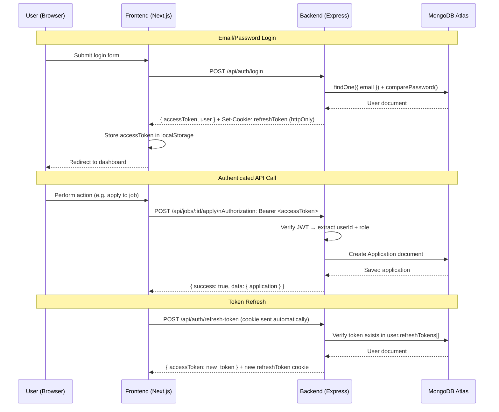
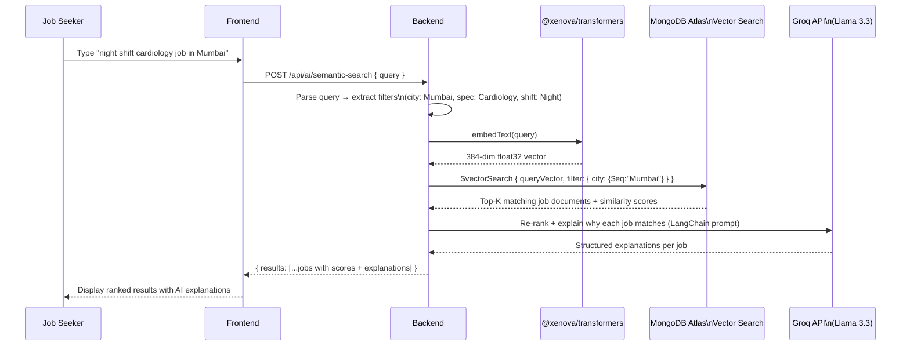

# CareerMade — Healthcare Job Platform Backend

> A production-ready, AI-powered healthcare job platform backend built with Node.js, Express, MongoDB Atlas, and LangChain.js.

[](https://nodejs.org/)
[](https://www.mongodb.com/atlas)
[](https://js.langchain.com/)
[](LICENSE)

---

## 🧑‍💻 Tech Stack

| Component | Technology |
|---|---|
| **Runtime** | Node.js 20+ |
| **Framework** | Express.js |
| **Database** | MongoDB Atlas (Mongoose ODM) |
| **Authentication** | JWT (Access + Refresh Tokens), Google OAuth 2.0 (Passport.js) |
| **AI / LLM** | LangChain.js, Groq API (Llama 3.3 70B), Google Gemini |
| **Vector Embeddings** | `@xenova/transformers` — `all-MiniLM-L6-v2` (384-dim, runs locally) |
| **Vector Search** | MongoDB Atlas Vector Search (ANN) |
| **File Storage** | Cloudinary (resumes, PDFs, images, cover letters) |
| **Email** | Nodemailer (SMTP / Gmail) |
| **PDF Generation** | PDFKit |
| **Deployment** | Render, Docker, Docker Compose |

---

## ✨ Features

### 1. 🔐 Secure Authentication System
- JWT access tokens (15-min) + refresh tokens (30-day, HTTP-only cookies)
- Account lockout after repeated failed login attempts (brute-force protection)
- Google OAuth 2.0 (Passport.js) for one-click login/signup
- Email verification (24-hour token), password reset (1-hour token), welcome emails
- Role-based access control: `jobseeker`, `employer`, `admin`

### 2. 🏢 Employer Job Management
- Full CRUD for job postings with 15+ filterable attributes
- Employer verification workflow (admin-gated before job posting)
- Server-side pagination, sorting, and multi-field filtering
- Auto-triggers vector embedding on every job create/update (non-blocking, fire-and-forget)
- Status management: `Open`, `Closed`, `Expired`

### 3. 👤 Job Seeker Profile Management
- Rich structured profiles: bio, 30 healthcare specializations, work experience, education, skills, certifications, languages, projects, job preferences, privacy settings
- Cloudinary-based resume + cover letter upload, replace, and delete
- Profile completion scoring
- Sub-APIs for projects and languages (add/update/delete)

### 4. 📄 InstantCV — Resume Builder + PDF Export
- Structured resume data model: personal info, summary, experience, education, skills, certifications, projects, languages, custom sections
- Server-side PDF generation (PDFKit) with skill badges, date-aligned experience, and customizable styling (font, colors, spacing)
- Upload generated PDFs to Cloudinary, track `pdfUrl`, view count, and download count
- Multiple resume versions per user, set-default functionality
- Per-resume preview and download endpoints

### 5. 🤖 AI — Resume Summary Generator *(Feature 1)*
- LangChain.js + Groq (Llama 3.3 70B) prompt chain
- Formats experience, education, skills into LLM context
- Supports tone options; optionally auto-saves summary to resume

### 6. 🎯 AI — Smart Job-Resume Match Scorer *(Feature 2)*
- LangChain.js + Groq structured JSON output
- Returns overall score (0–100) + breakdown: skills, experience, education, specialization
- Matched/missing skills, top 3 strengths, 3 improvement suggestions, verdict summary
- Robust LLM output parsing with JSON extraction fallback (handles markdown fences)

### 7. 🔍 AI — Semantic Job Search / RAG Pipeline *(Feature 4)*
- Full RAG pipeline: query → embed (384-dim, local) → Atlas Vector Search → LLM re-rank
- NLP query parsing extracts structured filters (city, specialization, shift, job type) from natural language
- Auto-falls back to text search if vector search unavailable
- Atlas-compatible `$eq` operator filters for all pre-filter fields
- Admin batch-indexing endpoint + embedding coverage stats
- Model: `Xenova/all-MiniLM-L6-v2` (quantized, cached locally in `.model-cache/`)

### 8. 📋 Application Tracking System (ATS)
- 6 statuses: Applied → Under Review → Interview → Offered → Rejected → Withdrawn
- Full immutable audit trail (history array with actor, timestamp, note)
- Multi-source resume selection: profile resume, InstantCV-built resume, or fresh upload per job
- Smart data fallback: if job seeker used Resume Builder over base profile, backend auto-merges data on employer view
- Employer-side candidate rating (1–5 stars) + profile match score display
- Non-blocking email notifications on all key lifecycle events

### 9. 🔖 Saved Jobs
- Save/bookmark jobs with unique constraint
- Dedicated bookmarks list endpoint

### 10. 🛡️ Admin Panel
- User, employer, and job management
- Employer verification approval/rejection

### 11. 📧 Automated Email Notifications
- 6 email types with branded HTML templates
- Email verification, welcome, password reset, application submitted, status update (Interview/Offered), new application received (employer)
- Non-blocking dispatch — never affects API response times

### 12. 🌐 Public Job Board
- Public listing with `optionalAuth` (works for both guests and logged-in users)
- Advanced multi-field filtering + server-side pagination

---

## 🚀 Quick Start

### Prerequisites
- Node.js 20+
- MongoDB Atlas account with:
  - A cluster
  - A Vector Search index named `job_vector_index` on the `jobs` collection, `embedding` field, 384 dimensions
- Cloudinary account
- Groq API key (free tier available at [console.groq.com](https://console.groq.com))
- Gmail account (for Nodemailer) or any SMTP provider

### Installation

```bash
# Clone the repository
git clone https://github.com/your-org/careermade-backend.git
cd careermade-backend

# Install dependencies
npm install

# Copy environment variables
cp .env.example .env
# Fill in all required values (see Environment Variables section)

# Start development server
npm run dev
```

### Docker

```bash
# Start with Docker Compose
docker-compose up --build
```

---

## 🔑 Environment Variables

```env
# Server
PORT=5000
NODE_ENV=development
FRONTEND_URL=http://localhost:3000

# MongoDB
MONGODB_URI=mongodb+srv://<user>:<pass>@cluster.mongodb.net/careermade
MONGODB_VECTOR_INDEX_NAME=job_vector_index

# JWT
JWT_SECRET=your-super-secret-jwt-key
JWT_REFRESH_SECRET=your-refresh-secret
JWT_EXPIRES_IN=15m
JWT_REFRESH_EXPIRES_IN=30d

# Google OAuth
GOOGLE_CLIENT_ID=your-google-client-id
GOOGLE_CLIENT_SECRET=your-google-client-secret
GOOGLE_CALLBACK_URL=http://localhost:5000/api/auth/google/callback

# Cloudinary
CLOUDINARY_CLOUD_NAME=your-cloud-name
CLOUDINARY_API_KEY=your-api-key
CLOUDINARY_API_SECRET=your-api-secret

# Email (Nodemailer)
EMAIL_HOST=smtp.gmail.com
EMAIL_PORT=587
EMAIL_USER=your-gmail@gmail.com
EMAIL_PASS=your-app-password
EMAIL_FROM=noreply@careermade.com

# AI Features
GROQ_API_KEY=your-groq-api-key
GOOGLE_GEMINI_API_KEY=your-gemini-api-key
EMBEDDING_MODEL=Xenova/all-MiniLM-L6-v2

# Feature Flags
AI_RESUME_SUMMARY_ENABLED=true
AI_MATCH_SCORING_ENABLED=true
AI_SEMANTIC_SEARCH_ENABLED=true
```

---

## 📁 Project Structure

```
lifemate_backend/
├── config/           # Database, Cloudinary, AI config
├── controllers/      # Route handlers
│   ├── authController.js
│   ├── jobController.js
│   ├── applicationController.js
│   ├── resumeController.js
│   ├── jobSeekerController.js
│   ├── employerController.js
│   ├── aiController.js
│   └── adminController.js
├── middlewares/      # Auth, upload, validation
├── models/           # Mongoose schemas
│   ├── User.js
│   ├── JobSeeker.js
│   ├── Employer.js
│   ├── Job.js
│   ├── Application.js
│   ├── Resume.js
│   └── SavedJob.js
├── routes/           # Express routers
├── services/
│   ├── ai/
│   │   ├── summaryChain.js        # Feature 1: Summary generator
│   │   ├── matchScorer.js         # Feature 2: Match scorer
│   │   ├── semanticSearch.js      # Feature 4: RAG pipeline
│   │   ├── jobEmbeddingPipeline.js
│   │   ├── embeddingConfig.js     # @xenova/transformers setup
│   │   └── llmConfig.js           # LangChain LLM setup
│   ├── emailService.js            # Nodemailer templates
│   └── pdfService.js              # PDFKit resume generation
├── utils/            # Response helpers, JWT utils
├── docs/             # Internal dev documentation
├── server.js
├── Dockerfile
└── docker-compose.yml
```

---

## 📡 API Reference

### Authentication (`/api/auth`)
| Method | Endpoint | Access |
|---|---|---|
| POST | `/register` | Public |
| POST | `/login` | Public |
| POST | `/logout` | Public |
| POST | `/refresh-token` | Public |
| GET | `/verify-email/:token` | Public |
| POST | `/forgot-password` | Public |
| POST | `/reset-password/:token` | Public |
| GET | `/google` | Public (OAuth) |

### Jobs (`/api/jobs`)
| Method | Endpoint | Access |
|---|---|---|
| GET | `/` | Public |
| GET | `/my` | Employer |
| GET | `/:id` | Public |
| POST | `/` | Verified Employer |
| PATCH | `/:id` | Employer/Admin |
| PATCH | `/:id/status` | Employer/Admin |
| DELETE | `/:id` | Employer/Admin |
| POST | `/:id/apply` | Job Seeker |

### Applications (`/api/applications`)
| Method | Endpoint | Access |
|---|---|---|
| GET | `/me` | Job Seeker |
| GET | `/employer` | Employer |
| GET | `/job/:jobId` | Employer |
| GET | `/:id` | Owner |
| PATCH | `/:id/status` | Employer/Admin |
| PATCH | `/:id/rating` | Employer/Admin |

### Resume Builder (`/api/resume`)
| Method | Endpoint | Access |
|---|---|---|
| GET | `/list` | Job Seeker |
| POST | `/build` | Job Seeker |
| GET | `/:id` | Job Seeker |
| PUT | `/:id` | Job Seeker |
| DELETE | `/:id` | Job Seeker |
| GET | `/:id/preview` | Job Seeker |
| POST | `/:id/download` | Job Seeker |
| POST | `/:id/generate-pdf` | Job Seeker |
| POST | `/:id/set-default` | Job Seeker |

### AI (`/api/ai`)
| Method | Endpoint | Access |
|---|---|---|
| POST | `/generate-summary` | Job Seeker |
| POST | `/match-score` | Job Seeker |
| POST | `/semantic-search` | Job Seeker |
| POST | `/index-job/:jobId` | Authenticated |
| POST | `/batch-index-jobs` | Admin |
| GET | `/embedding-stats` | Admin |

---

## 🤝 Contributing

Pull requests are welcome. Please open an issue first to discuss major changes.

---

## 🏗️ System Architecture

### Full-Stack Overview



---

### 🔗 Frontend ↔ Backend Connection Map

| Frontend Page / Feature | Backend API Called | Auth Required |
|---|---|---|
| **Login / Register** | `POST /api/auth/login` · `POST /api/auth/register` | None |
| **Google OAuth** | `GET /api/auth/google` → callback → redirect with token | None |
| **Job Seeker Dashboard** | `GET /api/jobs` · `GET /api/applications/me` | Job Seeker |
| **View Job Detail** | `GET /api/jobs/:id` | Optional |
| **Apply to Job** | `POST /api/jobs/:id/apply` (multipart form) | Job Seeker |
| **AI Match Score** | `POST /api/ai/match-score` | Job Seeker |
| **AI Semantic Search** | `POST /api/ai/semantic-search` | Job Seeker |
| **AI Summary Generator** | `POST /api/ai/generate-summary` | Job Seeker |
| **InstantCV Builder** | `POST /api/resume/build` · `PUT /api/resume/:id` | Job Seeker |
| **PDF Download** | `POST /api/resume/:id/generate-pdf` → Cloudinary URL | Job Seeker |
| **Profile Page** | `GET/PUT /api/jobseeker/profile` | Job Seeker |
| **Upload Resume/Cover** | `POST /api/jobseeker/resume` (multipart) | Job Seeker |
| **Bookmarks** | `GET /api/saved-jobs` · `POST /api/saved-jobs/jobs/:id/save` | Job Seeker |
| **Employer Dashboard** | `GET /api/jobs/my` · `GET /api/applications/employer` | Employer |
| **Post / Edit Job** | `POST /api/jobs` · `PATCH /api/jobs/:id` | Verified Employer |
| **Review Application** | `GET /api/applications/:id` · `PATCH /api/applications/:id/status` | Employer |
| **Employer Profile** | `POST/GET /api/employer/profile` | Employer |
| **Admin Panel** | `GET /api/admin/users` · `GET /api/admin/employers` | Admin |
| **Public Job Board** | `GET /api/jobs?...filters` | None (optional auth) |

---

### 📡 Authentication Flow



---

### 🔍 AI Semantic Search — RAG Flow



---

## 📄 License

MIT